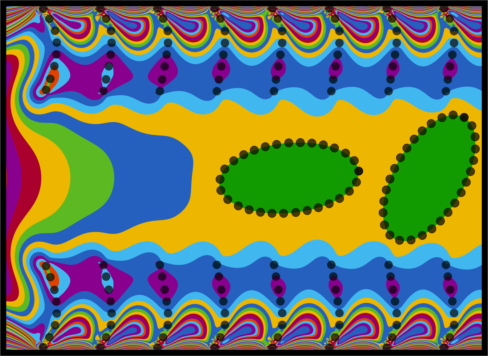

<!-- Banner image: recommend uploading the rotated version as e.g. "banner-landscape.jpg" in your repo -->

  

  <em>[Artwork: Winner, Arts & Science Competition, ECCOMAS Congress 2024 (Lisbon)](Eccomas_competition_winner_certificate.jpeg)</em>

  

<h1 align="center">Hi, I'm Divyaprakash 👋</h1>

  <b>Computational Researcher | CFD | Scientific Computing | Machine Learning</b>

  <a href="https://dpcfd.com">🌐 Website</a> |
  <a href="https://www.linkedin.com/in/divyaprakash-iitd/">LinkedIn</a> |
  <a href="https://github.com/divyaprakash-iitd">GitHub</a> |
  <a href="https://scholar.google.com/citations?user=YOUR_SCHOLAR_ID">Google Scholar</a>

---

> "Fluid dynamics is the art of describing the motion of the invisible."  
> — Inspired by Ludwig Prandtl

---

### 🧑‍🔬 About Me

I am a computational researcher specializing in scientific computing, computational fluid dynamics, and machine learning applications in fluid mechanics. My focus is on developing and implementing numerical simulations and computational models to solve complex flow and fluid-structure interaction problems.

- **PhD Student**, Indian Institute of Technology Delhi (Applied Mechanics)
- Experience teaching advanced fluid mechanics & CFD courses
- Passionate about open-source research, reproducibility, and science communication

---

### 🚀 Featured Projects

- [**flexfem**](https://github.com/divyaprakash-iitd/flexfem): A flexible, extensible finite element solver for fluid-structure interactions.
- [**ellipseLBM**](https://github.com/divyaprakash-iitd/ellipseLBM): Lattice Boltzmann Method simulations for ellipsoidal particles in flow.
- ...and more! See my pinned repos and [project portfolio](https://dpcfd.com/projects).

---

### 🛠️ Skills

- **Languages:** Python, Fortran, C/C++, MATLAB
- **Tools:** OpenFOAM, ANSYS, StarCCM+, FDS, SU2, Git
- **Expertise:** CFD, DNS/LES, immersed boundary methods, ML for physical systems

---

### 📚 Publications & Activities

- Publications in machine learning for DNS, cilia modeling, and fluid-structure interaction ([Google Scholar](https://scholar.google.com/citations?user=YOUR_SCHOLAR_ID))
- Conference presentations at ECCOMAS, preCICE Workshop, and more
- Open to research collaborations and interdisciplinary projects

---

### 📫 Get in Touch

- [dpcfd.com](https://dpcfd.com) | divyaprakash.poddar@gmail.com

---

  <em>“Science is a way of thinking much more than it is a body of knowledge.”</em>

